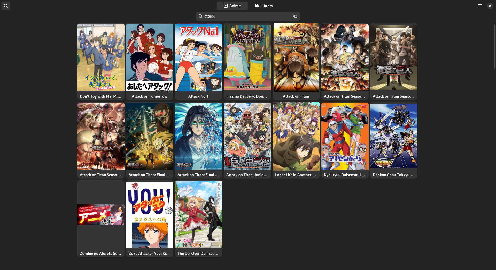
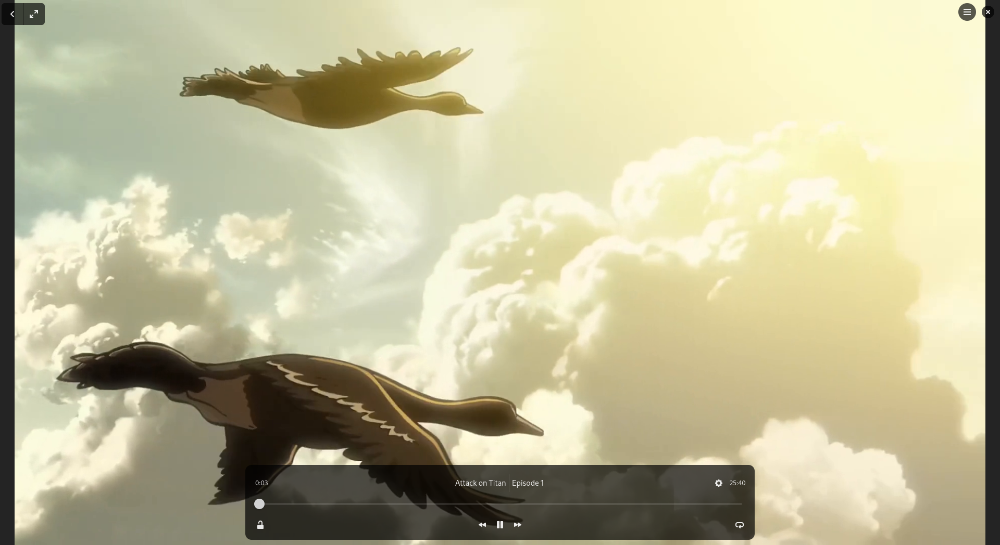
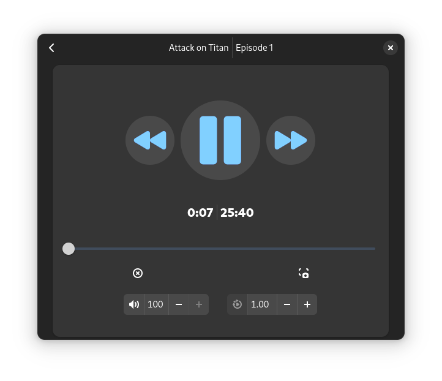

# Ronajo

    

    

## About

Ronajo is an app for browsing and watching anime powered by [GStreamer](https://gstreamer.freedesktop.org/) and the [GTK4](https://www.gtk.org/) toolkit. The app relies on [Allanime](https://allanime.to/) and The [Jikan Api]("https://jikan.moe/").

Ronajo has a tui counterpart, [Husbando](https://github.com/HerbGlitch/husbando).

## Dependencies

- libssh
- gtk >= 4.16
- libadwaita >= 1.6
- gstreamer >= 1.24.6
  
## Special Thanks
- Thanks to [Herbglitch](https://github.com/HerbGlitch) for making the scraping algorithm.
- Thanks to [ani-cli](https://github.com/pystardust/ani-cli) for inspiring this app.

